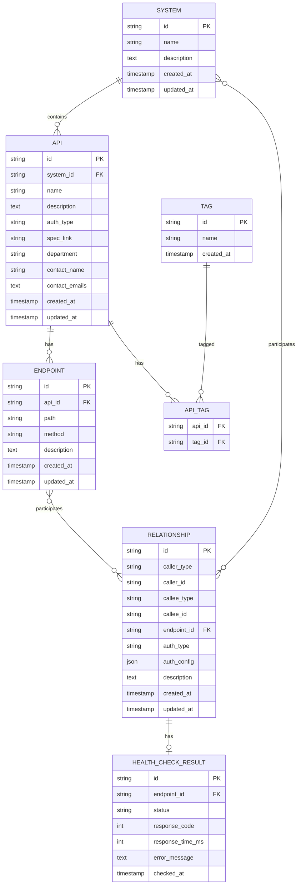

# 设计文档

## 概述

API管理系统是一个基于Python的微服务应用，使用FastAPI框架，使用PostgreSQL作为数据存储。系统提供RESTful API用于管理API元数据、调用关系，并支持拓扑图可视化和健康检查功能。

### 技术栈

- **运行时**: Python 11+
- **框架**: FastAPI (高性能Python Web框架，自动生成OpenAPI文档)
- **数据库**: PostgreSQL
- **API文档**: OpenAPI 3.0 (由FastAPI自动生成)
- **构建工具**: pip
- **数据访问**: SQLAlchemy ORM
- **异步支持**: asyncio 和 httpx

## 架构

### 整体架构

系统采用分层架构设计：

```
┌─────────────────────────────────────┐
│         API Gateway (REST)          │
│           (FastAPI Router)          │
└─────────────────────────────────────┘
                 │
┌─────────────────────────────────────┐
│        Router Layer                 │
│  - api_router                       │
│  - system_router                    │
│  - endpoint_router                  │
│  - relationship_router              │
│  - health_check_router              │
└─────────────────────────────────────┘
                 │
┌─────────────────────────────────────┐
│         Service Layer               │
│  - ApiService                       │
│  - SystemService                    │
│  - EndpointService                  │
│  - RelationshipService              │
│  - HealthCheckService               │
└─────────────────────────────────────┘
                 │
┌─────────────────────────────────────┐
│       Repository Layer              │
│  - ApiRepository                    │
│  - SystemRepository                 │
│  - EndpointRepository               │
│  - RelationshipRepository           │
│  - TagRepository                    │
│  - HealthCheckResultRepository      │
└─────────────────────────────────────┘
                 │
┌─────────────────────────────────────┐
│      PostgreSQL Database            │
│         (Local or Cloud)            │
└─────────────────────────────────────┘
```

### 部署架构

- 使用FastAPI内置的开发服务器或生产级服务器（如Gunicorn + Uvicorn）
- SQLAlchemy ORM用于数据库访问，支持同步和异步操作
- 环境变量配置数据库连接信息
- 支持容器化部署（如Docker）

## 组件和接口

### 1. Router层

#### api_router
负责API实体的CRUD操作

**端点**:
- `POST /api/v1/apis` - 创建API
- `GET /api/v1/apis/{api_id}` - 获取API详情
- `PUT /api/v1/apis/{api_id}` - 更新API
- `DELETE /api/v1/apis/{api_id}` - 删除API
- `GET /api/v1/apis` - 查询API列表（支持标签筛选和系统ID筛选）

#### endpoint_router
负责Endpoint的CRUD操作

**端点**:
- `POST /api/v1/endpoints` - 创建Endpoint
- `GET /api/v1/endpoints/{endpoint_id}` - 获取Endpoint详情
- `PUT /api/v1/endpoints/{endpoint_id}` - 更新Endpoint
- `DELETE /api/v1/endpoints/{endpoint_id}` - 删除Endpoint
- `GET /api/v1/endpoints` - 查询Endpoint列表
- `GET /api/v1/endpoints/api/{api_id}` - 获取指定API的所有Endpoint

#### system_router
负责系统的CRUD操作

**端点**:
- `POST /api/v1/systems` - 创建系统
- `GET /api/v1/systems/{system_id}` - 获取系统详情
- `PUT /api/v1/systems/{system_id}` - 更新系统
- `DELETE /api/v1/systems/{system_id}` - 删除系统
- `GET /api/v1/systems` - 查询系统列表

#### relationship_router
负责调用关系的管理

**端点**:
- `POST /api/v1/relationships` - 创建调用关系
- `GET /api/v1/relationships/{relationship_id}` - 获取调用关系详情
- `PUT /api/v1/relationships/{relationship_id}` - 更新调用关系
- `DELETE /api/v1/relationships/{relationship_id}` - 删除调用关系
- `GET /api/v1/relationships` - 查询调用关系列表（支持调用方和被调用方筛选）

#### health_check_router
负责API健康检查

**端点**:
- `POST /api/v1/health/check/{endpoint_id}` - 检查单个端点健康状态
- `POST /api/v1/health/batch` - 批量健康检查
- `GET /api/v1/health/results/{endpoint_id}` - 获取端点的健康检查结果
- `GET /api/v1/health/results` - 获取最近的健康检查结果

#### OpenAPI文档
FastAPI自动生成OpenAPI 3.0规格文档

**端点**:
- `GET /docs` - Swagger UI文档
- `GET /redoc` - ReDoc文档
- `GET /openapi.json` - OpenAPI 3.0规格文档

### 2. Service层

#### ApiService
- 业务逻辑：API实体的创建、更新、删除、查询
- 标签管理
- 邮箱格式验证
- 与系统服务的集成

#### SystemService
- 业务逻辑：系统的创建、更新、删除、查询
- 系统关联的API查询
- 系统名称唯一性验证

#### EndpointService
- 业务逻辑：端点的创建、更新、删除、查询
- 与API服务的集成
- 端点路径和方法的验证

#### RelationshipService
- 业务逻辑：调用关系的创建、更新、删除、查询
- 验证调用方和被调用方的存在性
- 支持多态关系（系统或API）
- 与端点服务的集成

#### HealthCheckService
- 执行HTTP健康检查请求
- 异步批量检查
- 结果聚合和存储
- 支持超时处理

### 3. Repository层

使用SQLAlchemy ORM进行数据访问

#### ApiRepository
```python
class ApiRepository:
    def __init__(self, db: Session):
        self.db = db
    
    def create(self, api: Api) -> Api:
        """创建API"""
        self.db.add(api)
        self.db.commit()
        self.db.refresh(api)
        return api
    
    def find_by_id(self, api_id: Union[uuid.UUID, str]) -> Optional[Api]:
        """根据ID查找API"""
        return self.db.query(Api).filter(Api.id == api_id).first()
    
    def find_all(self) -> List[Api]:
        """查找所有API"""
        return self.db.query(Api).order_by(Api.name).all()
    
    def find_by_system_id(self, system_id: Union[uuid.UUID, str]) -> List[Api]:
        """根据系统ID查找API"""
        return self.db.query(Api).filter(Api.system_id == system_id).order_by(Api.name).all()
    
    def find_by_tags(self, tags: Set[str]) -> List[Api]:
        """根据标签查找API"""
        # 实现标签筛选逻辑
        pass
    
    def update(self, api: Api) -> Optional[Api]:
        """更新API"""
        existing_api = self.find_by_id(api.id)
        if existing_api:
            for key, value in api.__dict__.items():
                if key != '_sa_instance_state':
                    setattr(existing_api, key, value)
            self.db.commit()
            self.db.refresh(existing_api)
            return existing_api
        return None
    
    def delete(self, api_id: Union[uuid.UUID, str]) -> bool:
        """删除API"""
        api = self.find_by_id(api_id)
        if api:
            self.db.delete(api)
            self.db.commit()
            return True
        return False
```

#### SystemRepository
```python
class SystemRepository:
    def __init__(self, db: Session):
        self.db = db
    
    def create(self, system: System) -> System:
        """创建系统"""
        self.db.add(system)
        self.db.commit()
        self.db.refresh(system)
        return system
    
    def find_by_id(self, system_id: Union[uuid.UUID, str]) -> Optional[System]:
        """根据ID查找系统"""
        return self.db.query(System).filter(System.id == system_id).first()
    
    def find_by_name(self, name: str) -> Optional[System]:
        """根据名称查找系统"""
        return self.db.query(System).filter(System.name == name).first()
    
    def find_all(self) -> List[System]:
        """查找所有系统"""
        return self.db.query(System).order_by(System.name).all()
    
    def update(self, system: System) -> Optional[System]:
        """更新系统"""
        existing_system = self.find_by_id(system.id)
        if existing_system:
            for key, value in system.__dict__.items():
                if key != '_sa_instance_state':
                    setattr(existing_system, key, value)
            self.db.commit()
            self.db.refresh(existing_system)
            return existing_system
        return None
    
    def delete(self, system_id: Union[uuid.UUID, str]) -> bool:
        """删除系统"""
        system = self.find_by_id(system_id)
        if system:
            self.db.delete(system)
            self.db.commit()
            return True
        return False
```

#### EndpointRepository
```python
class EndpointRepository:
    def __init__(self, db: Session):
        self.db = db
    
    def create(self, endpoint: Endpoint) -> Endpoint:
        """创建端点"""
        self.db.add(endpoint)
        self.db.commit()
        self.db.refresh(endpoint)
        return endpoint
    
    def find_by_id(self, endpoint_id: Union[uuid.UUID, str]) -> Optional[Endpoint]:
        """根据ID查找端点"""
        return self.db.query(Endpoint).filter(Endpoint.id == endpoint_id).first()
    
    def find_by_api_id(self, api_id: Union[uuid.UUID, str]) -> List[Endpoint]:
        """根据API ID查找端点"""
        return self.db.query(Endpoint).filter(Endpoint.api_id == api_id).order_by(Endpoint.path, Endpoint.method).all()
    
    def find_all(self) -> List[Endpoint]:
        """查找所有端点"""
        return self.db.query(Endpoint).order_by(Endpoint.path, Endpoint.method).all()
    
    def update(self, endpoint: Endpoint) -> Optional[Endpoint]:
        """更新端点"""
        existing_endpoint = self.find_by_id(endpoint.id)
        if existing_endpoint:
            for key, value in endpoint.__dict__.items():
                if key != '_sa_instance_state':
                    setattr(existing_endpoint, key, value)
            self.db.commit()
            self.db.refresh(existing_endpoint)
            return existing_endpoint
        return None
    
    def delete(self, endpoint_id: Union[uuid.UUID, str]) -> bool:
        """删除端点"""
        endpoint = self.find_by_id(endpoint_id)
        if endpoint:
            self.db.delete(endpoint)
            self.db.commit()
            return True
        return False
```

#### RelationshipRepository
```python
class RelationshipRepository:
    def __init__(self, db: Session):
        self.db = db
    
    def create(self, relationship: Relationship) -> Relationship:
        """创建调用关系"""
        self.db.add(relationship)
        self.db.commit()
        self.db.refresh(relationship)
        return relationship
    
    def find_by_id(self, relationship_id: Union[uuid.UUID, str]) -> Optional[Relationship]:
        """根据ID查找调用关系"""
        return self.db.query(Relationship).filter(Relationship.id == relationship_id).first()
    
    def find_all(self) -> List[Relationship]:
        """查找所有调用关系"""
        return self.db.query(Relationship).all()
    
    def find_by_caller(self, caller_type: str, caller_id: Union[uuid.UUID, str]) -> List[Relationship]:
        """根据调用方查找调用关系"""
        return self.db.query(Relationship).filter(
            Relationship.caller_type == caller_type,
            Relationship.caller_id == caller_id
        ).all()
    
    def find_by_callee(self, callee_type: str, callee_id: Union[uuid.UUID, str]) -> List[Relationship]:
        """根据被调用方查找调用关系"""
        return self.db.query(Relationship).filter(
            Relationship.callee_type == callee_type,
            Relationship.callee_id == callee_id
        ).all()
    
    def update(self, relationship: Relationship) -> Optional[Relationship]:
        """更新调用关系"""
        existing_relationship = self.find_by_id(relationship.id)
        if existing_relationship:
            for key, value in relationship.__dict__.items():
                if key != '_sa_instance_state':
                    setattr(existing_relationship, key, value)
            self.db.commit()
            self.db.refresh(existing_relationship)
            return existing_relationship
        return None
    
    def delete(self, relationship_id: Union[uuid.UUID, str]) -> bool:
        """删除调用关系"""
        relationship = self.find_by_id(relationship_id)
        if relationship:
            self.db.delete(relationship)
            self.db.commit()
            return True
        return False
```

#### TagRepository
```python
class TagRepository:
    def __init__(self, db: Session):
        self.db = db
    
    def create(self, name: str) -> Tag:
        """创建标签"""
        # 检查标签是否已存在
        existing_tag = self.find_by_name(name)
        if existing_tag:
            return existing_tag
        
        # 创建新标签
        tag = Tag(name=name)
        self.db.add(tag)
        self.db.commit()
        self.db.refresh(tag)
        return tag
    
    def find_by_name(self, name: str) -> Optional[Tag]:
        """根据名称查找标签"""
        return self.db.query(Tag).filter(Tag.name == name).first()
    
    def find_by_id(self, tag_id: Union[uuid.UUID, str]) -> Optional[Tag]:
        """根据ID查找标签"""
        return self.db.query(Tag).filter(Tag.id == tag_id).first()
    
    def find_all(self) -> List[Tag]:
        """查找所有标签"""
        return self.db.query(Tag).order_by(Tag.name).all()
    
    def delete(self, tag_id: Union[uuid.UUID, str]) -> bool:
        """删除标签"""
        tag = self.find_by_id(tag_id)
        if tag:
            self.db.delete(tag)
            self.db.commit()
            return True
        return False
```

#### HealthCheckResultRepository
```python
class HealthCheckResultRepository:
    def __init__(self, db: Session):
        self.db = db
    
    def create(self, health_check_result: HealthCheckResult) -> HealthCheckResult:
        """创建健康检查结果"""
        self.db.add(health_check_result)
        self.db.commit()
        self.db.refresh(health_check_result)
        return health_check_result
    
    def find_by_id(self, result_id: Union[uuid.UUID, str]) -> Optional[HealthCheckResult]:
        """根据ID查找健康检查结果"""
        return self.db.query(HealthCheckResult).filter(HealthCheckResult.id == result_id).first()
    
    def find_by_endpoint_id(self, endpoint_id: Union[uuid.UUID, str]) -> List[HealthCheckResult]:
        """根据端点ID查找健康检查结果"""
        return self.db.query(HealthCheckResult).filter(
            HealthCheckResult.endpoint_id == endpoint_id
        ).order_by(desc(HealthCheckResult.checked_at)).all()
    
    def find_latest_by_endpoint_id(self, endpoint_id: Union[uuid.UUID, str]) -> Optional[HealthCheckResult]:
        """查找端点的最新健康检查结果"""
        return self.db.query(HealthCheckResult).filter(
            HealthCheckResult.endpoint_id == endpoint_id
        ).order_by(desc(HealthCheckResult.checked_at)).first()
    
    def delete(self, result_id: Union[uuid.UUID, str]) -> bool:
        """删除健康检查结果"""
        result = self.find_by_id(result_id)
        if result:
            self.db.delete(result)
            self.db.commit()
            return True
        return False
```

## 数据模型

### 实体关系图



### 数据库表结构

#### systems表
```sql
CREATE TABLE systems (
    id VARCHAR(36) PRIMARY KEY,
    name VARCHAR(255) NOT NULL UNIQUE,
    description TEXT,
    created_at TIMESTAMP NOT NULL DEFAULT CURRENT_TIMESTAMP,
    updated_at TIMESTAMP NOT NULL DEFAULT CURRENT_TIMESTAMP
);

CREATE INDEX idx_systems_name ON systems(name);
```

#### apis表
```sql
CREATE TABLE apis (
    id VARCHAR(36) PRIMARY KEY,
    system_id VARCHAR(36) NOT NULL REFERENCES systems(id) ON DELETE CASCADE,
    name VARCHAR(255) NOT NULL,
    description TEXT,
    auth_type VARCHAR(50),
    spec_link VARCHAR(1000),
    department VARCHAR(255),
    contact_name VARCHAR(255),
    contact_emails TEXT, -- 逗号分隔的邮箱列表
    created_at TIMESTAMP NOT NULL DEFAULT CURRENT_TIMESTAMP,
    updated_at TIMESTAMP NOT NULL DEFAULT CURRENT_TIMESTAMP,
    CONSTRAINT chk_auth_type CHECK (auth_type IN ('API_KEY', 'OAUTH2', 'BASIC_AUTH', 'JWT', 'NONE'))
);

CREATE INDEX idx_apis_system_id ON apis(system_id);
CREATE INDEX idx_apis_name ON apis(name);
```

#### endpoints表
```sql
CREATE TABLE endpoints (
    id VARCHAR(36) PRIMARY KEY,
    api_id VARCHAR(36) NOT NULL REFERENCES apis(id) ON DELETE CASCADE,
    path VARCHAR(1000) NOT NULL,
    method VARCHAR(10) NOT NULL,
    description TEXT,
    created_at TIMESTAMP NOT NULL DEFAULT CURRENT_TIMESTAMP,
    updated_at TIMESTAMP NOT NULL DEFAULT CURRENT_TIMESTAMP,
    CONSTRAINT chk_method CHECK (method IN ('GET', 'POST', 'PUT', 'DELETE', 'PATCH', 'HEAD', 'OPTIONS')),
    UNIQUE (api_id, path, method)
);

CREATE INDEX idx_endpoints_api_id ON endpoints(api_id);
CREATE INDEX idx_endpoints_path ON endpoints(path);
```

#### tags表
```sql
CREATE TABLE tags (
    id VARCHAR(36) PRIMARY KEY,
    name VARCHAR(100) NOT NULL UNIQUE,
    created_at TIMESTAMP NOT NULL DEFAULT CURRENT_TIMESTAMP
);

CREATE INDEX idx_tags_name ON tags(name);
```

#### api_tags表
```sql
CREATE TABLE api_tags (
    api_id VARCHAR(36) NOT NULL REFERENCES apis(id) ON DELETE CASCADE,
    tag_id VARCHAR(36) NOT NULL REFERENCES tags(id) ON DELETE CASCADE,
    PRIMARY KEY (api_id, tag_id)
);

CREATE INDEX idx_api_tags_tag_id ON api_tags(tag_id);
```

#### relationships表
```sql
CREATE TABLE relationships (
    id VARCHAR(36) PRIMARY KEY,
    caller_type VARCHAR(10) NOT NULL,
    caller_id VARCHAR(36) NOT NULL,
    callee_type VARCHAR(10) NOT NULL,
    callee_id VARCHAR(36) NOT NULL,
    endpoint_id VARCHAR(36) NOT NULL REFERENCES endpoints(id) ON DELETE CASCADE,
    auth_type VARCHAR(50),
    auth_config JSON,
    description TEXT,
    created_at TIMESTAMP NOT NULL DEFAULT CURRENT_TIMESTAMP,
    updated_at TIMESTAMP NOT NULL DEFAULT CURRENT_TIMESTAMP,
    CONSTRAINT chk_caller_type CHECK (caller_type IN ('SYSTEM', 'API')),
    CONSTRAINT chk_callee_type CHECK (callee_type IN ('SYSTEM', 'API')),
    CONSTRAINT chk_relationship_auth_type CHECK (auth_type IN ('API_KEY', 'OAUTH2', 'BASIC_AUTH', 'JWT', 'NONE'))
);

CREATE INDEX idx_relationships_caller ON relationships(caller_type, caller_id);
CREATE INDEX idx_relationships_callee ON relationships(callee_type, callee_id);
CREATE INDEX idx_relationships_endpoint ON relationships(endpoint_id);
```

#### health_check_results表
```sql
CREATE TABLE health_check_results (
    id VARCHAR(36) PRIMARY KEY,
    endpoint_id VARCHAR(36) NOT NULL REFERENCES endpoints(id) ON DELETE CASCADE,
    status VARCHAR(20) NOT NULL,
    response_code INT,
    response_time_ms INT,
    error_message TEXT,
    checked_at TIMESTAMP NOT NULL DEFAULT CURRENT_TIMESTAMP,
    CONSTRAINT chk_status CHECK (status IN ('SUCCESS', 'FAILURE', 'TIMEOUT'))
);

CREATE INDEX idx_health_check_results_endpoint_id ON health_check_results(endpoint_id);
CREATE INDEX idx_health_check_results_checked_at ON health_check_results(checked_at DESC);
```

### Python实体类（SQLAlchemy模型）

#### System
```python
from sqlalchemy import Column, String, Text, DateTime
from sqlalchemy.sql import func
from sqlalchemy.orm import relationship
from ..database import Base

class System(Base):
    __tablename__ = "systems"
    
    id = Column(String(36), primary_key=True, index=True)
    name = Column(String(255), nullable=False, unique=True, index=True)
    description = Column(Text)
    created_at = Column(DateTime(timezone=True), server_default=func.now())
    updated_at = Column(DateTime(timezone=True), server_default=func.now(), onupdate=func.now())
    
    # Relationships
    apis = relationship("Api", back_populates="system", cascade="all, delete-orphan")
```

#### Api
```python
from sqlalchemy import Column, String, Text, DateTime, ForeignKey
from sqlalchemy.sql import func
from sqlalchemy.orm import relationship
from ..database import Base

class Api(Base):
    __tablename__ = "apis"
    
    id = Column(String(36), primary_key=True, index=True)
    system_id = Column(String(36), ForeignKey("systems.id", ondelete="CASCADE"), nullable=False, index=True)
    name = Column(String(255), nullable=False, index=True)
    description = Column(Text)
    auth_type = Column(String(50))
    spec_link = Column(String(1000))
    department = Column(String(255))
    contact_name = Column(String(255))
    contact_emails = Column(Text)  # 逗号分隔的邮箱列表
    created_at = Column(DateTime(timezone=True), server_default=func.now())
    updated_at = Column(DateTime(timezone=True), server_default=func.now(), onupdate=func.now())
    
    # Relationships
    system = relationship("System", back_populates="apis")
    endpoints = relationship("Endpoint", back_populates="api", cascade="all, delete-orphan")
    tags = relationship("Tag", secondary="api_tags", back_populates="apis")
```

#### Endpoint
```python
from sqlalchemy import Column, String, Text, DateTime, ForeignKey, CheckConstraint, UniqueConstraint
from sqlalchemy.sql import func
from sqlalchemy.orm import relationship
from ..database import Base

class Endpoint(Base):
    __tablename__ = "endpoints"
    
    id = Column(String(36), primary_key=True, index=True)
    api_id = Column(String(36), ForeignKey("apis.id", ondelete="CASCADE"), nullable=False, index=True)
    path = Column(String(1000), nullable=False, index=True)
    method = Column(String(10), nullable=False)
    description = Column(Text)
    created_at = Column(DateTime(timezone=True), server_default=func.now())
    updated_at = Column(DateTime(timezone=True), server_default=func.now(), onupdate=func.now())
    
    # Constraints
    __table_args__ = (
        CheckConstraint("method IN ('GET', 'POST', 'PUT', 'DELETE', 'PATCH', 'HEAD', 'OPTIONS')", name="chk_method"),
        UniqueConstraint('api_id', 'path', 'method', name='uq_api_path_method'),
    )
    
    # Relationships
    api = relationship("Api", back_populates="endpoints")
    relationships = relationship("Relationship", back_populates="endpoint")
    health_check_results = relationship("HealthCheckResult", back_populates="endpoint", cascade="all, delete-orphan")
```

#### Tag
```python
from sqlalchemy import Column, String, DateTime
from sqlalchemy.sql import func
from sqlalchemy.orm import relationship
from ..database import Base

class Tag(Base):
    __tablename__ = "tags"
    
    id = Column(String(36), primary_key=True, index=True)
    name = Column(String(100), nullable=False, unique=True, index=True)
    created_at = Column(DateTime(timezone=True), server_default=func.now())
    
    # Relationships
    apis = relationship("Api", secondary="api_tags", back_populates="tags")
```

#### Relationship
```python
from sqlalchemy import Column, String, Text, DateTime, ForeignKey, CheckConstraint
from sqlalchemy.sql import func
from sqlalchemy.orm import relationship
from ..database import Base

class Relationship(Base):
    __tablename__ = "relationships"
    
    id = Column(String(36), primary_key=True, index=True)
    caller_type = Column(String(10), nullable=False)
    caller_id = Column(String(36), nullable=False)
    callee_type = Column(String(10), nullable=False)
    callee_id = Column(String(36), nullable=False)
    endpoint_id = Column(String(36), ForeignKey("endpoints.id", ondelete="CASCADE"), nullable=False, index=True)
    auth_type = Column(String(50))
    auth_config = Column(String)  # JSON string
    description = Column(Text)
    created_at = Column(DateTime(timezone=True), server_default=func.now())
    updated_at = Column(DateTime(timezone=True), server_default=func.now(), onupdate=func.now())
    
    # Constraints
    __table_args__ = (
        CheckConstraint("caller_type IN ('SYSTEM', 'API')", name="chk_caller_type"),
        CheckConstraint("callee_type IN ('SYSTEM', 'API')", name="chk_callee_type"),
        CheckConstraint("auth_type IN ('API_KEY', 'OAUTH2', 'BASIC_AUTH', 'JWT', 'NONE')", name="chk_relationship_auth_type"),
    )
    
    # Relationships
    endpoint = relationship("Endpoint", back_populates="relationships")
```

#### HealthCheckResult
```python
from sqlalchemy import Column, String, Text, DateTime, ForeignKey, Integer, CheckConstraint, Index
from sqlalchemy.sql import func
from sqlalchemy.orm import relationship
from ..database import Base

class HealthCheckResult(Base):
    __tablename__ = "health_check_results"
    
    id = Column(String(36), primary_key=True, index=True)
    endpoint_id = Column(String(36), ForeignKey("endpoints.id", ondelete="CASCADE"), nullable=False, index=True)
    status = Column(String(20), nullable=False)
    response_code = Column(Integer)
    response_time_ms = Column(Integer)
    error_message = Column(Text)
    checked_at = Column(DateTime(timezone=True), server_default=func.now(), index=True)
    
    # Constraints
    __table_args__ = (
        CheckConstraint("status IN ('SUCCESS', 'FAILURE', 'TIMEOUT')", name="chk_status"),
        Index('idx_health_check_results_checked_at', 'checked_at', postgresql_using='btree', postgresql_descending_in_nulls_first=True),
    )
    
    # Relationships
    endpoint = relationship("Endpoint", back_populates="health_check_results")
```

### 枚举类型

```python
from enum import Enum

class HttpMethod(str, Enum):
    GET = "GET"
    POST = "POST"
    PUT = "PUT"
    DELETE = "DELETE"
    PATCH = "PATCH"
    HEAD = "HEAD"
    OPTIONS = "OPTIONS"

class AuthType(str, Enum):
    API_KEY = "API_KEY"
    OAUTH2 = "OAUTH2"
    BASIC_AUTH = "BASIC_AUTH"
    JWT = "JWT"
    NONE = "NONE"

class EntityType(str, Enum):
    SYSTEM = "SYSTEM"
    API = "API"

class HealthCheckStatus(str, Enum):
    SUCCESS = "SUCCESS"
    FAILURE = "FAILURE"
    TIMEOUT = "TIMEOUT"
```

## API规格 (OpenAPI 3.0)

### 核心DTO定义

#### ApiDTO
```python
from pydantic import BaseModel, Field
from typing import List, Set, Optional
from datetime import datetime
from .enums import AuthType

class ApiDTO(BaseModel):
    id: Optional[str] = None
    system_id: Optional[str] = None
    system_name: Optional[str] = None
    name: str = Field(..., max_length=255)
    description: Optional[str] = Field(None, max_length=2000)
    auth_type: Optional[AuthType] = None
    spec_link: Optional[str] = Field(None, max_length=1000)
    department: Optional[str] = Field(None, max_length=255)
    contact_name: Optional[str] = Field(None, max_length=255)
    contact_emails: List[str] = []  # 邮箱列表
    tags: Set[str] = set()
    endpoints: List['EndpointDTO'] = []
    created_at: Optional[datetime] = None
    updated_at: Optional[datetime] = None
    
    class Config:
        from_attributes = True
```

#### CreateApiRequest
```python
from pydantic import BaseModel, Field, EmailStr
from typing import List, Set, Optional
from .enums import AuthType

class CreateApiRequest(BaseModel):
    system_id: str
    name: str = Field(..., max_length=255)
    description: Optional[str] = Field(None, max_length=2000)
    auth_type: Optional[AuthType] = None
    spec_link: Optional[str] = Field(None, max_length=1000)
    department: Optional[str] = Field(None, max_length=255)
    contact_name: Optional[str] = Field(None, max_length=255)
    contact_emails: List[EmailStr] = []  # 邮箱列表，每个邮箱都需要验证格式
    tags: Optional[Set[str]] = set()
```

#### EndpointDTO
```python
from pydantic import BaseModel, Field
from typing import Optional
from datetime import datetime
from .enums import HttpMethod

class EndpointDTO(BaseModel):
    id: Optional[str] = None
    api_id: Optional[str] = None
    path: str = Field(..., max_length=1000)
    method: HttpMethod
    description: Optional[str] = Field(None, max_length=2000)
    created_at: Optional[datetime] = None
    updated_at: Optional[datetime] = None
    
    class Config:
        from_attributes = True
```

#### CreateEndpointRequest
```python
from pydantic import BaseModel, Field
from typing import Optional
from .enums import HttpMethod

class CreateEndpointRequest(BaseModel):
    api_id: str
    path: str = Field(..., max_length=1000)
    method: HttpMethod
    description: Optional[str] = Field(None, max_length=2000)
```

#### RelationshipDTO
```python
from pydantic import BaseModel, Field
from typing import Optional, Dict, Any
from datetime import datetime
from .enums import EntityType, AuthType, HttpMethod

class RelationshipDTO(BaseModel):
    id: Optional[str] = None
    caller_type: EntityType
    caller_id: str
    caller_name: Optional[str] = None
    callee_type: EntityType
    callee_id: str
    callee_name: Optional[str] = None
    endpoint_id: str
    endpoint_path: Optional[str] = None
    endpoint_method: Optional[HttpMethod] = None
    auth_type: Optional[AuthType] = None
    auth_config: Optional[Dict[str, Any]] = None
    description: Optional[str] = Field(None, max_length=2000)
    created_at: Optional[datetime] = None
    updated_at: Optional[datetime] = None
    
    class Config:
        from_attributes = True
```

#### CreateRelationshipRequest
```python
from pydantic import BaseModel, Field
from typing import Optional, Dict, Any
from .enums import EntityType, AuthType

class CreateRelationshipRequest(BaseModel):
    caller_type: EntityType
    caller_id: str
    callee_type: EntityType
    callee_id: str
    endpoint_id: str  # 必须指定调用的endpoint
    auth_type: Optional[AuthType] = None
    auth_config: Optional[Dict[str, Any]] = None
    description: Optional[str] = Field(None, max_length=2000)
```

#### TopologyDTO
```python
from pydantic import BaseModel
from typing import List, Dict, Any, Optional
from .enums import EntityType, AuthType

class NodeDTO(BaseModel):
    id: str
    name: str
    type: EntityType
    metadata: Optional[Dict[str, Any]] = None

class EdgeDTO(BaseModel):
    id: str
    source_id: str
    target_id: str
    auth_type: Optional[AuthType] = None
    metadata: Optional[Dict[str, Any]] = None

class TopologyDTO(BaseModel):
    nodes: List[NodeDTO]
    edges: List[EdgeDTO]
```

#### HealthCheckResultDTO
```python
from pydantic import BaseModel
from typing import Optional, List
from datetime import datetime
from .enums import HttpMethod, HealthCheckStatus

class HealthCheckResultDTO(BaseModel):
    endpoint_id: str
    endpoint_path: Optional[str] = None
    http_method: Optional[HttpMethod] = None
    status: HealthCheckStatus
    response_code: Optional[int] = None
    response_time_ms: Optional[int] = None
    error_message: Optional[str] = None
    checked_at: datetime
    
    class Config:
        from_attributes = True

class BatchHealthCheckRequest(BaseModel):
    endpoint_ids: List[str]

class BatchHealthCheckResponse(BaseModel):
    batch_id: str
    results: List[HealthCheckResultDTO]
    total_count: int
    success_count: int
    failure_count: int
```

### OpenAPI规格文档结构

系统将生成完整的OpenAPI 3.0规格文档，包含：

1. **基本信息**
   - 标题：API Management System
   - 版本：1.0.0
   - 描述：微服务API管理和拓扑可视化系统

2. **服务器配置**
   - 开发环境URL
   - 生产环境URL

3. **认证方案**
   - Bearer Token (JWT)

4. **所有端点定义**
   - 路径、方法、参数
   - 请求体schema
   - 响应schema
   - 错误响应

5. **数据模型schemas**
   - 所有DTO的JSON Schema定义
   - 枚举类型定义

## 错误处理

### 错误响应格式

```python
from pydantic import BaseModel
from typing import Optional, Dict
from datetime import datetime

class ErrorResponse(BaseModel):
    error: str
    message: str
    path: str
    timestamp: datetime
    details: Optional[Dict[str, str]] = None
```

### HTTP状态码使用

- `200 OK` - 成功的GET/PUT请求
- `201 Created` - 成功的POST请求
- `204 No Content` - 成功的DELETE请求
- `400 Bad Request` - 请求参数验证失败
- `404 Not Found` - 资源不存在
- `409 Conflict` - 资源冲突（如重复创建）
- `500 Internal Server Error` - 服务器内部错误

### 异常处理器

```python
from fastapi import Request, status
from fastapi.responses import JSONResponse
from fastapi.exceptions import RequestValidationError
from typing import Optional
from datetime import datetime

async def global_exception_handler(request: Request, exc: Exception) -> JSONResponse:
    """全局异常处理器"""
    return JSONResponse(
        status_code=status.HTTP_500_INTERNAL_SERVER_ERROR,
        content={
            "error": "Internal Server Error",
            "message": str(exc),
            "path": request.url.path,
            "timestamp": datetime.utcnow(),
            "details": None
        }
    )

async def validation_exception_handler(request: Request, exc: RequestValidationError) -> JSONResponse:
    """请求参数验证异常处理器"""
    details = {}
    for error in exc.errors():
        field = error.get("loc")[-1] if error.get("loc") else "unknown"
        details[field] = error.get("msg")
    
    return JSONResponse(
        status_code=status.HTTP_400_BAD_REQUEST,
        content={
            "error": "Validation Error",
            "message": "请求参数验证失败",
            "path": request.url.path,
            "timestamp": datetime.utcnow(),
            "details": details
        }
    )
```

## 测试策略

### 单元测试

- 使用pytest和unittest.mock
- 测试Service层业务逻辑
- 测试Repository层SQL查询逻辑
- 目标覆盖率：80%以上

### 集成测试

- 使用pytest和SQLAlchemy的测试工具
- 使用SQLite内存数据库进行快速测试
- 测试完整的API端点
- 测试异步数据库操作

### 性能测试

- API响应时间测试（目标<500ms）
- 批量健康检查性能测试
- 数据库查询性能测试

### 测试数据

- 使用SQLAlchemy的create_all()方法创建测试数据库schema
- 使用fixture和factory_boy生成测试数据

## 部署配置

### FastAPI配置 (.env)

```env
# 数据库配置
DATABASE_URL=postgresql://localhost:5432/apimgmt
DATABASE_USERNAME=postgres
DATABASE_PASSWORD=postgres

# 应用配置
APP_NAME=API Management System
APP_VERSION=1.0.0
DEBUG=False

# CORS配置
CORS_ORIGINS=http://localhost:3000,http://localhost:8080

# 健康检查配置
HEALTH_CHECK_TIMEOUT=30
```

### 应用配置 (config.py)

```python
import os
from pydantic_settings import BaseSettings
from typing import List

class Settings(BaseSettings):
    """应用配置"""
    # 应用配置
    app_name: str = "API Management System"
    app_version: str = "1.0.0"
    debug: bool = False
    
    # 数据库配置
    database_url: str = os.getenv("DATABASE_URL", "postgresql://localhost:5432/apimgmt")
    
    # CORS配置
    cors_origins: List[str] = os.getenv("CORS_ORIGINS", "http://localhost:3000").split(",")
    
    # 健康检查配置
    health_check_timeout: int = int(os.getenv("HEALTH_CHECK_TIMEOUT", "30"))
    
    class Config:
        env_file = ".env"

settings = Settings()
```

### AWS Lambda配置

- 内存：1024 MB
- 超时：30秒
- 环境变量：
  - `DATABASE_URL`
  - `DATABASE_USERNAME`
  - `DATABASE_PASSWORD`
  - `APP_NAME`
  - `APP_VERSION`
- VPC配置：连接到RDS所在VPC

### 数据库迁移

使用SQLAlchemy的自动迁移或Alembic进行数据库版本管理：

```python
# 使用SQLAlchemy自动创建表结构
from sqlalchemy import create_engine
from sqlalchemy.orm import sessionmaker
from apimgmt.database import Base
from apimgmt.models import System, Api, Endpoint, Tag, Relationship, HealthCheckResult

# 创建引擎
engine = create_engine(settings.database_url)

# 创建所有表
Base.metadata.create_all(bind=engine)
```

### 启动脚本

```python
# main.py
from fastapi import FastAPI
from fastapi.middleware.cors import CORSMiddleware
from apimgmt.config import settings
from apimgmt.routers import api_router, system_router, endpoint_router, relationship_router, health_check_router
from apimgmt.database import engine, Base

# 创建数据库表
Base.metadata.create_all(bind=engine)

# 创建FastAPI应用
app = FastAPI(
    title=settings.app_name,
    version=settings.app_version,
    description="微服务API管理和拓扑可视化系统"
)

# 配置CORS
app.add_middleware(
    CORSMiddleware,
    allow_origins=settings.cors_origins,
    allow_credentials=True,
    allow_methods=["*"],
    allow_headers=["*"],
)

# 注册路由
app.include_router(api_router, prefix="/api/v1")
app.include_router(system_router, prefix="/api/v1")
app.include_router(endpoint_router, prefix="/api/v1")
app.include_router(relationship_router, prefix="/api/v1")
app.include_router(health_check_router, prefix="/api/v1")

# 根路径
@app.get("/")
async def root():
    return {"message": "API Management System", "version": settings.app_version}

# 启动应用
if __name__ == "__main__":
    import uvicorn
    uvicorn.run(app, host="0.0.0.0", port=8000)
```

## 安全考虑

1. **API认证**：使用JWT token验证请求
2. **SQL注入防护**：使用SQLAlchemy ORM的参数化查询
3. **输入验证**：使用Pydantic验证所有输入
4. **敏感信息**：auth_config使用加密存储
5. **CORS配置**：使用FastAPI的CORSMiddleware配置允许的前端域名

## 性能优化

1. **数据库索引**：在常用查询字段上创建索引
2. **连接池**：使用SQLAlchemy的连接池管理数据库连接
3. **缓存**：考虑使用Redis缓存拓扑图数据
4. **异步处理**：健康检查使用异步执行
5. **分页**：列表查询支持分页
6. **异步API**：使用FastAPI的异步支持提高并发性能
